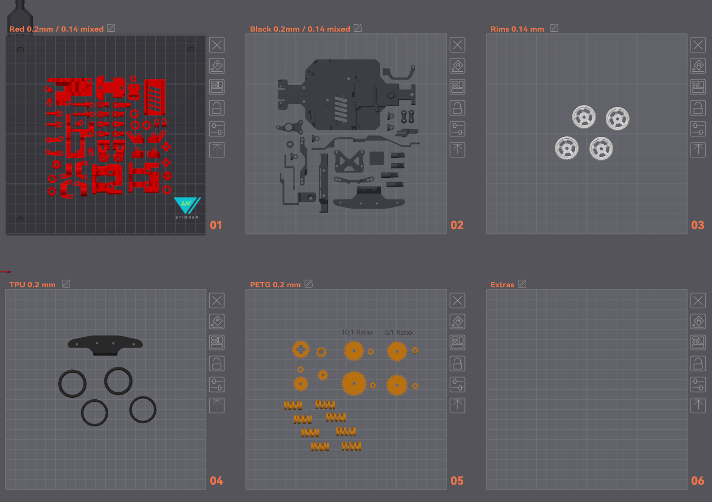

  

   
  

	<h1 align="center"><b>LHS RC MICRO-D 24R Chassis</b></h1>
	
 <strong>
		A 3D Printed 1:24 scale RC Car Chassis.  </strong>
     
     

</a>
  

  

**The LHS RC MICRO-D 24R Chassis is an adjustable 1:24 scale 3D printed RC chassis using plain common hardware.
Inspired by the micro RC scene (Kyosho) and the aftermarket drift chassis**

*Requires a highly optimized and precise 3D printer capable of 0.14 layer heights and <0.1mm tolerances*

## Features
 

- Fully 3D printed (apart from generic fasteners and electronics)
- High steering angle suitable for drifting setups
- RWD locked differential
- Adjustable suspension geometry: Shocks, Toe, Camber, Caster, Ackerman
- 10:1 Gearbox Ratio
- 180 DC Motor (support for 130 and other motor types)
- One size up electronics

## Resources
 

- [**Online Cad Viewer**](http://tiny.cc/lhs-rc)  
- [**BOM**](https://docs.google.com/spreadsheets/d/1McK3dMZJtdG0EwnIzz4Fmolz2wLCNfXcopYI-H6RcH4/edit?usp=sharing)  
- [**Print Files**](Micro-D_24R_OrcaSlicer.3mf)  

 

*The provided 3mf file is set up for Orca Slicer and includes a lot of per-part optimizations required for optimal results. It is recommended to swap your printer and filament profiles, but keep the printing settings.*  

  

 

 

*There are currently no detailed build instructions. Please follow the CAD and join us on the [LH Stinger Discord](https://discord.gg/EzssCfnEDS)*
 

## License

This work is licensed under a [Creative Commons (4.0 International License)  ](https://creativecommons.org/licenses/by-nc-sa/4.0/)  
[**Attribution—Noncommercial—Share Alike**](LICENSE.md)  
 
  
 
